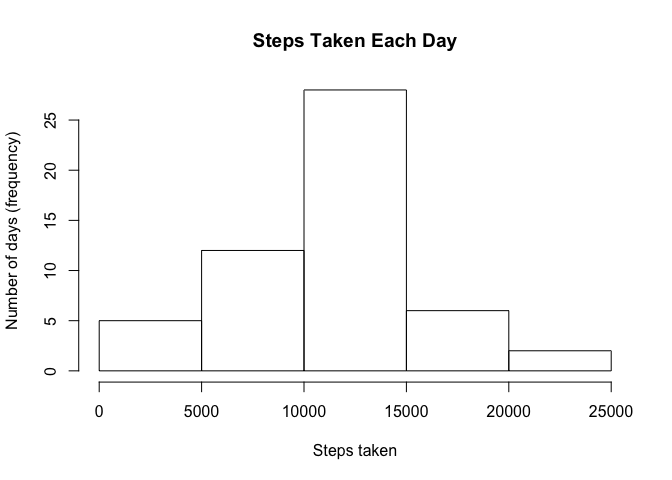
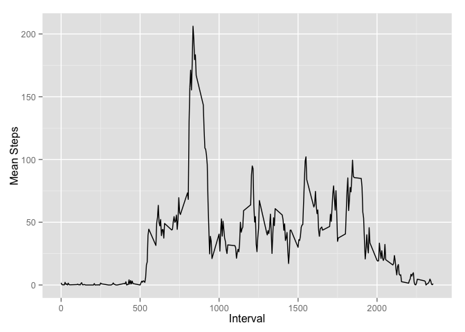
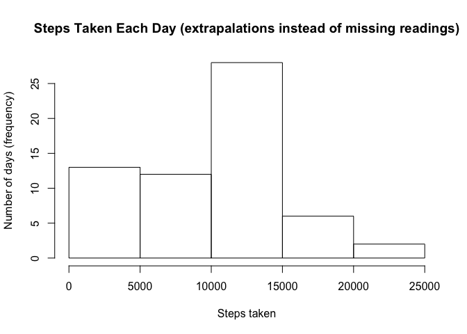

# Reproducible Research: Peer Assessment 1


## Loading and preprocessing the data


The variables included in this dataset are:  

- steps: Number of steps taking in a 5-minute interval (missing values are coded as NA)
- date: The date on which the measurement was taken in YYYY-MM-DD format
- interval: Identifier for the 5-minute interval in which measurement was taken


The data is loaded from activity.csv and stored in activity. 


```r
activity <- read.csv("activity.csv") 
```

## What is mean total number of steps taken per day?


###1. The total number of steps taken per day###

The total number of steps taken each day is calculated using the code below. The steps taken on each day in the data, where a valid reading is recorded (not NA) are summed and recorded in days.Steps. 


```r
library(plyr)
# Sum steps for each day where the value is recorded for the interval
days.Steps <- ddply(subset(activity[c("date","steps")], !(is.na(steps)) ), "date", colwise(sum))
```

The following cade prints the table containing the calculated steps taken on each day (contents of days.Steps). The output shows the date and the total steps taken on that date.   


```r
library(knitr)
kable(days.Steps[,1:2], align="c")
```

    date       steps 
------------  -------
 2012-10-02     126  
 2012-10-03    11352 
 2012-10-04    12116 
 2012-10-05    13294 
 2012-10-06    15420 
 2012-10-07    11015 
 2012-10-09    12811 
 2012-10-10    9900  
 2012-10-11    10304 
 2012-10-12    17382 
 2012-10-13    12426 
 2012-10-14    15098 
 2012-10-15    10139 
 2012-10-16    15084 
 2012-10-17    13452 
 2012-10-18    10056 
 2012-10-19    11829 
 2012-10-20    10395 
 2012-10-21    8821  
 2012-10-22    13460 
 2012-10-23    8918  
 2012-10-24    8355  
 2012-10-25    2492  
 2012-10-26    6778  
 2012-10-27    10119 
 2012-10-28    11458 
 2012-10-29    5018  
 2012-10-30    9819  
 2012-10-31    15414 
 2012-11-02    10600 
 2012-11-03    10571 
 2012-11-05    10439 
 2012-11-06    8334  
 2012-11-07    12883 
 2012-11-08    3219  
 2012-11-11    12608 
 2012-11-12    10765 
 2012-11-13    7336  
 2012-11-15     41   
 2012-11-16    5441  
 2012-11-17    14339 
 2012-11-18    15110 
 2012-11-19    8841  
 2012-11-20    4472  
 2012-11-21    12787 
 2012-11-22    20427 
 2012-11-23    21194 
 2012-11-24    14478 
 2012-11-25    11834 
 2012-11-26    11162 
 2012-11-27    13646 
 2012-11-28    10183 
 2012-11-29    7047  
   
###2. The data in days.Steps is used to create a histogram of the total number of steps taken each day ###   

The code below breaks the range of steps in to 5 and plots a histogram of the frequency of each of the 5 range steps in terms of days.


```r
hist(days.Steps$steps, breaks=5, main="Steps Taken Each Day", xlab = "Steps taken", ylab="Number of days (frequency)")
```

 


###3. The mean and median of the total number of step taken per day (in days.Steps) are then calcuated###

The code below calculates the mean and median steps per day.   
**Note**: where no measurements were available in the activity data for an entire day, the day is excluded from the calculation of the mean and median.   


```r
mean.Steps<-apply(days.Steps[2], 2, mean)
median.Steps<-apply(days.Steps[2], 2, median)
```


Using the calculated mean and median values above: 

- The **mean** total number of steps taken per day (mean.Steps) is calculated to be **10766.1886792**.   
- The **median** total number of steps taken per day (median.Steps) is calculated to be **10765**.   

## What is the average daily activity pattern?

###1. Make a time series plot (i.e. type = "l") of the 5-minute interval (x-axis) and the average number of steps taken, averaged across all days (y-axis)


To plot the avarage number of steps taken in each interval accross days, the activity data is processed to produce a vector that contins the total number of steps taken in each intervall accross all days (where a measrement is available).


```r
# Sum of steps for each interval accross all days.
interval.total.Steps <- ddply(subset(activity[c("interval","steps")], !(is.na(steps)) ), "interval", colwise(sum))
```

Once the totals for each interval are calculated, a mean is gound for each intervall by deviding the total by the number of days. Noting that each intervals occurs only once a day. The number of days (where a measrement is available) is simply the number of rows in days.Steps (it has one row per day).   


```r
# copy the data for calculation of mean
interval.mean.Steps  <- interval.total.Steps
# calculate mean by altering the steps column (ie total steps in the interval/ days)
sample.days <- nrow(days.Steps)
interval.mean.Steps$steps <- interval.mean.Steps$steps / sample.days
```

The data in interval.mean.Steps is used to make a time series plot of the 5-minute interval (x-axis) and the average number of steps taken, averaged across all days (y-axis) below:


```r
library(ggplot2)
p <- ggplot(interval.mean.Steps, aes(interval, steps)) + geom_line() +
      xlab("Interval") + ylab("Mean Steps")
print(p)
```

 

###2. Which 5-minute interval, on average across all the days in the dataset, contains the maximum number of steps?

The following extracts the row from interval.mean.Steps (as created above) which has the highest value for steps, ie it has the highest mean of any interval avaraged accross all the days in the dataset.   


```r
interval.maxmean <- interval.mean.Steps[ which(interval.mean.Steps$steps == max(interval.mean.Steps$steps)), ]
interval.id <- interval.maxmean$interval
interval.value <- interval.maxmean$steps
```


The 5-minute interval, on average across all the days in the dataset, that contains the maximum number of steps is the is calculated to be  **835**. (The mean number of steps in that interval is calculated to be **206.1698113**)   

## Imputing missing values

###1. Calculate and report the total number of missing values in the dataset (i.e. the total number of rows with NAs)###

The total number of rows with NA is calculated as follows:


```r
activity.with.noreading <- subset(activity, (is.na(steps)))
missing.values.total <- nrow(activity.with.noreading)
```

The total number of missing values in the dataset is **2304**.   
   
   

##2. A strategy for filling in all of the missing values in the dataset.

**The strategy for filling the 2304 missing step readings implemented below is to replace each missing reading with 0.**   

**NOTE:**  This simple stratagy was selected for expedience, however a better approach is to replace the missing values with avarage value accross all days of the interval for which the reading is missing.  


##3. Create a new dataset that is equal to the original dataset but with the missing data filled in.

The NAs are replace with 0.   


```r
activity.new <- activity
activity.new[is.na(activity.new)] <- 0
```

##4, Make a histogram of the total number of steps taken each day and Calculate and report the mean and median total number of steps taken per day. Do these values differ from the estimates from the first part of the assignment? What is the impact of imputing missing data on the estimates of the total daily number of steps?


```r
days.Steps.new <- ddply(subset(activity.new[c("date","steps")], !(is.na(steps)) ), "date", colwise(sum))
hist(days.Steps.new$steps, breaks=5, main="Steps Taken Each Day (extrapalations instead of missing readings)", xlab = "Steps taken", ylab="Number of days (frequency)")
```

 

```r
mean.Steps.new<-apply(days.Steps.new[2], 2, mean)
median.Steps.new<-apply(days.Steps.new[2], 2, median)
```


Using the new calculated mean and median values above for the dataset with extrapolated values replacing missing readings: 

- The **mean** total number of steps taken per day (mean.Steps) is calculated to be **9354.2295082**.  (previously **10766.1886792**) 
- The **median** total number of steps taken per day (median.Steps) is calculated to be **10395**. (previously **10765**)

The values do differ from the vlues from the first part of the assignment, The impact of inputing missing data (in this case making it 0) has reduced the estimates of the total daily number of steps. This effct depends on the selected strategy for dealing with missing readings.


## Are there differences in activity patterns between weekdays and weekends?

###1. Create a new factor variable in the dataset with two levels – “weekday” and “weekend” indicating whether a given date is a weekday or weekend day ?

The following code creates a new factor variable:   


```r
activity.new$date <- as.Date(activity.new$date)
wd <- c('Monday', 'Tuesday', 'Wednesday', 'Thursday', 'Friday')
activity.new$weekDay <- factor((weekdays(activity.new$date) %in% wd), levels=c(FALSE, TRUE), labels=c('weekend', 'weekday'))
```


###2. Make a panel plot containing a time series plot (i.e. type = "l") of the 5-minute interval (x-axis) and the average number of steps taken, averaged across all weekday days or weekend days (y-axis). See the README file in the GitHub repository to see an example of what this plot should look like using simulated data.

To plot the avarage number of steps taken in each interval accross days, the extrapalated activity data is processed to produce a vector that contins the total number of steps taken in each intervall accross all days.


```r
# Sum of steps for each interval accross all days.
interval.total.Steps.new <- ddply(subset(activity.new[c("interval","steps")], !(is.na(steps)) ), "interval", colwise(sum))
```

Once the totals for each interval are calculated, a mean is found for each interval by deviding the total by the number of days. Noting that each intervals occurs only once a day. The number of days is simply the number of rows in days.Steps.new (it has one row per day).   


```r
# copy the data for calculation of mean
interval.mean.Steps.new  <- interval.total.Steps.new
# calculate mean by altering the steps column (ie total steps in the interval/ days)
sample.days.new <- nrow(days.Steps.new)
interval.mean.Steps.new$steps <- interval.mean.Steps.new$steps / sample.days.new
```

The data in interval.mean.Steps.new is used to make a time series plot of the 5-minute interval (x-axis) and the average number of steps taken, averaged across all days (y-axis) below:


```r
library(ggplot2)
p <- ggplot(interval.mean.Steps, aes(interval, steps)) + geom_line() +
      xlab("Interval") + ylab("Mean Steps")
print(p)
```

 
